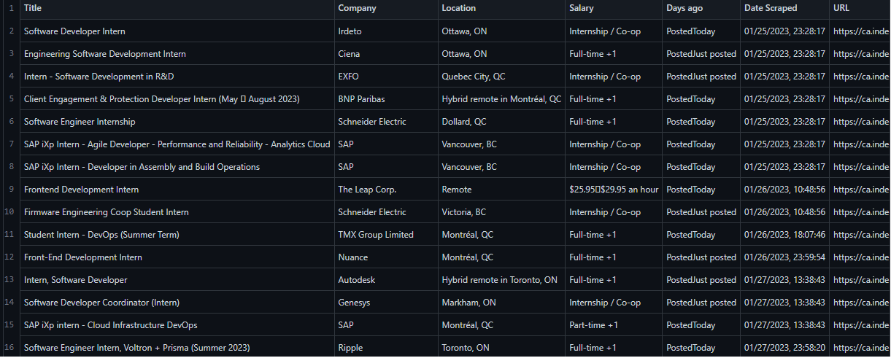

# EasyApply

A Job Scraper that Scrapes Jobs from popular websites with specified filters
<!--  -->
Example CSV file output

## Additional Features
Outputs results into a specified CSV(no duplicates)

## Setup
Simply download the file and run main.py (downloading required libraries)

## Incoming features
Will add graphs, summary and GUI, maybe host on web?
